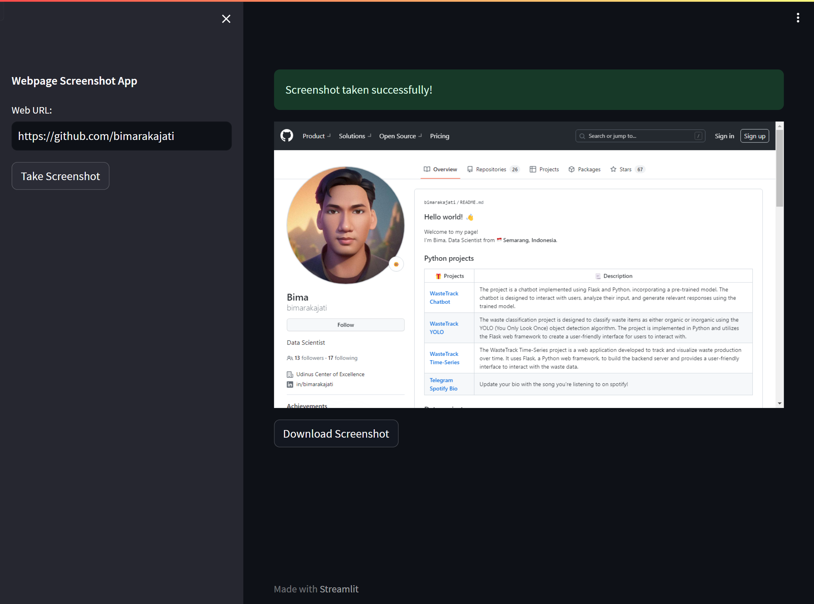

# Webpage Screenshot App

The Webpage Screenshot App is a simple and user-friendly web application built using Streamlit, a powerful Python library for creating web applications for data science and machine learning projects. This app allows users to capture screenshots of webpages by providing a URL.

## 📷 Screenshot


## ✨ Prerequisites

- Python 3.x
- Streamlit
- Selenium

## 🤖 Installation

1. Clone the repository:
   ```shell
   git clone https://github.com/bimarakajati/Webpage-Screenshot-App.git
   ```

2. Install the required dependencies:
    ```shell
    pip install -r requirements.txt
    ```

## 💁‍ Usage

1. Run the Flask app:
   ```shell
   streamlit run app.py
   ```
2. The app should now be running locally on your machine. Open your web browser and go to the address http://localhost:8501 to access the Webpage Screenshot App.
3. Enter the URL of the webpage you want to capture in the designated input box.
4. Click the "Take Screenshot" button to generate the screenshot.
5. Once the screenshot is ready, a preview will be displayed on the page.
6. Finally, use the "Download Screenshot" button to save the screenshot to your local machine.

## 📙 Reference

Thanks to their great works：
- https://docs.streamlit.io/